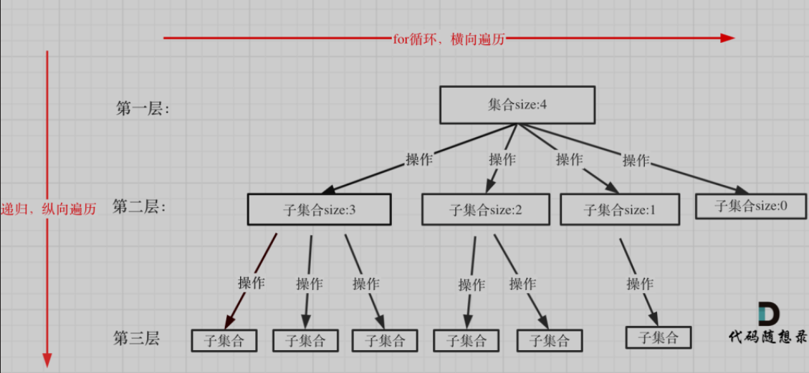

# 回溯法总结

回溯法，一般可以解决如下几种问题：

- 组合问题：N个数里面按一定规则找出k个数的集合
- 排列问题：N个数按一定规则全排列，有几种排列方式
- 切割问题：一个字符串按一定规则有几种切割方式
- 子集问题：一个N个数的集合里有多少符合条件的子集
- 棋盘问题：N皇后，解数独等等

**「回溯法解决的问题都可以抽象为树形结构」**




代码模板:
```cpp
void backtracking(argv) {
    if (终止条件) {
        存放结果;
        return;
    }

    for (选择：本层集合中元素（树中节点孩子的数量就是集合的大小）) {
        处理节点;
        backtracking(路径，选择列表); // 递归
        回溯，撤销处理结果
    }
}

```

## 习题
- leetcode 39. 组合总和
> https://leetcode-cn.com/problems/combination-sum/

优秀题解:https://leetcode-cn.com/problems/combination-sum/solution/39-zu-he-zong-he-hui-su-fa-jing-dian-ying-yong-xia/